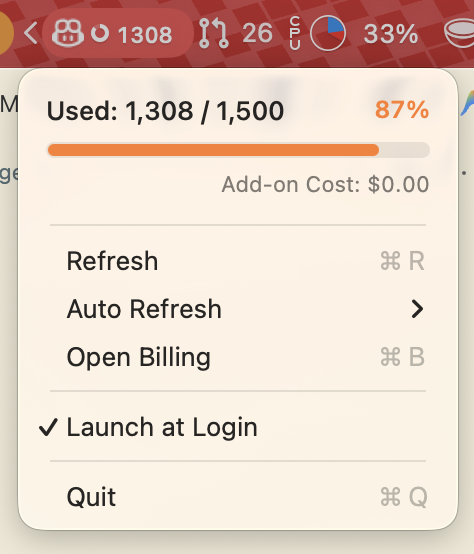

# Copilot Monitor

<p align="center">
  
</p>

<p align="center">
  <strong>GitHub Copilot 프리미엄 요청 사용량을 macOS 메뉴바에서 실시간으로 모니터링하세요.</strong>
</p>

<p align="center">
  <a href="https://github.com/kargnas/copilot-usage-monitor/releases/latest">
    
  </a>
  <a href="https://github.com/kargnas/copilot-usage-monitor/blob/main/LICENSE">
    
  </a>
  
  
</p>

---

## Features

- **메뉴바 실시간 표시**: 현재 사용량과 한도를 메뉴바 아이콘에서 바로 확인
- **시각적 프로그레스**: 사용량에 따른 색상 변화 (초록 → 노랑 → 주황 → 빨강)
- **추가 비용 추적**: 한도 초과 시 발생하는 Add-on 비용 표시
- **자동 새로고침**: 10초 ~ 30분 간격으로 자동 업데이트 설정 가능
- **로그인 시 자동 시작**: macOS 로그인 시 자동 실행 옵션
- **GitHub OAuth 인증**: 안전한 웹뷰 기반 로그인

## Installation

### Download (권장)

[**Releases**](https://github.com/kargnas/copilot-usage-monitor/releases/latest) 페이지에서 최신 `.dmg` 파일을 다운로드하세요.

### Build from Source

```bash
# 저장소 클론
git clone https://github.com/kargnas/copilot-usage-monitor.git
cd copilot-usage-monitor

# Xcode로 열기
open CopilotMonitor/CopilotMonitor.xcodeproj

# Xcode에서 빌드 (⌘B) 및 실행 (⌘R)
```

**요구 사항:**
- macOS 13.0+
- Xcode 15.0+
- Swift 5.9+

## Usage

1. **앱 실행**: `CopilotMonitor.app` 실행
2. **로그인**: 메뉴에서 "Sign In" 클릭 후 GitHub 계정으로 로그인
3. **모니터링**: 메뉴바에서 실시간 사용량 확인

### Menu Options

| 메뉴 항목 | 설명 | 단축키 |
|----------|------|--------|
| Refresh | 수동으로 사용량 새로고침 | `⌘R` |
| Auto Refresh | 자동 새로고침 간격 설정 (10초~30분) | - |
| Open Billing | GitHub 빌링 페이지 열기 | `⌘B` |
| Launch at Login | 로그인 시 자동 시작 토글 | - |
| Quit | 앱 종료 | `⌘Q` |

## How It Works

Copilot Monitor는 GitHub의 내부 API를 사용하여 사용량 데이터를 가져옵니다:

1. **인증**: WebView를 통한 GitHub OAuth 인증
2. **데이터 수집**: `/settings/billing/copilot_usage_card` API 호출
3. **캐싱**: 네트워크 오류 시 마지막 데이터 캐시 사용

> **Note**: 이 앱은 공식 GitHub API가 아닌 내부 웹 API를 사용합니다. GitHub의 UI 변경에 따라 동작이 달라질 수 있습니다.

## Privacy & Security

- **로컬 저장**: 모든 데이터는 로컬에만 저장됩니다
- **직접 통신**: GitHub 서버와 직접 통신하며, 제3자 서버를 거치지 않습니다
- **OAuth 인증**: 비밀번호를 저장하지 않고 GitHub OAuth 세션 사용

## Contributing

기여를 환영합니다! Pull Request를 보내주세요.

1. Fork the Project
2. Create your Feature Branch (`git checkout -b feature/AmazingFeature`)
3. Commit your Changes (`git commit -m 'Add some AmazingFeature'`)
4. Push to the Branch (`git push origin feature/AmazingFeature`)
5. Open a Pull Request

## License

MIT License - 자세한 내용은 [LICENSE](LICENSE) 파일을 참조하세요.

## Related

- [GitHub Copilot](https://github.com/features/copilot)
- [Copilot Billing Documentation](https://docs.github.com/en/billing/managing-billing-for-github-copilot)

---

<p align="center">
  Made with ❤️ for Copilot power users
</p>
